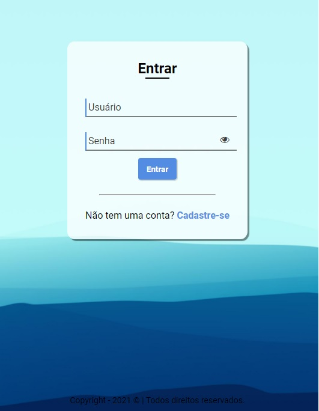
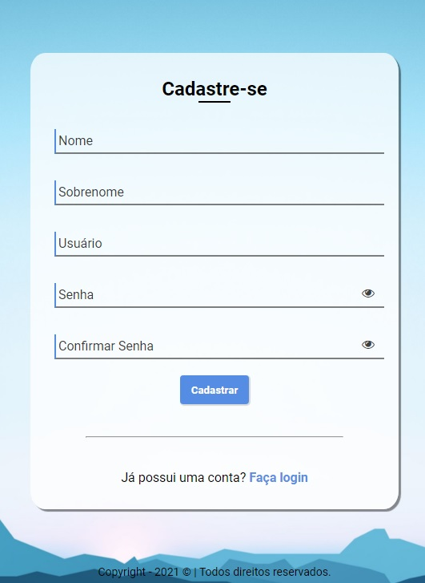
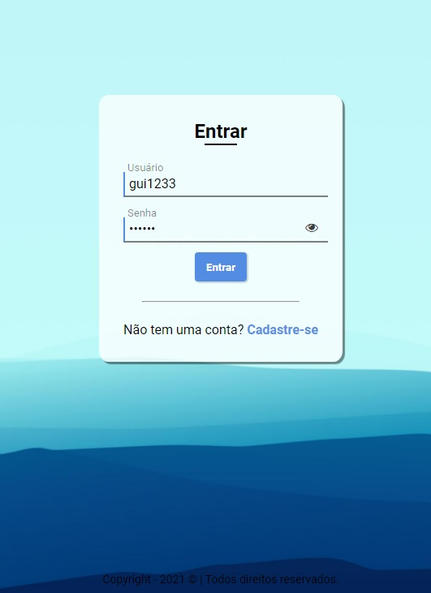
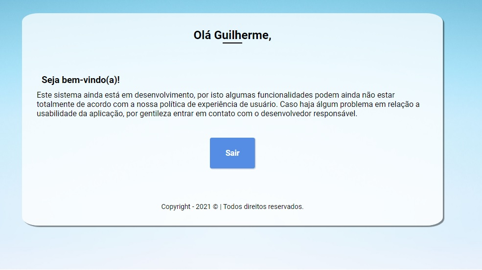
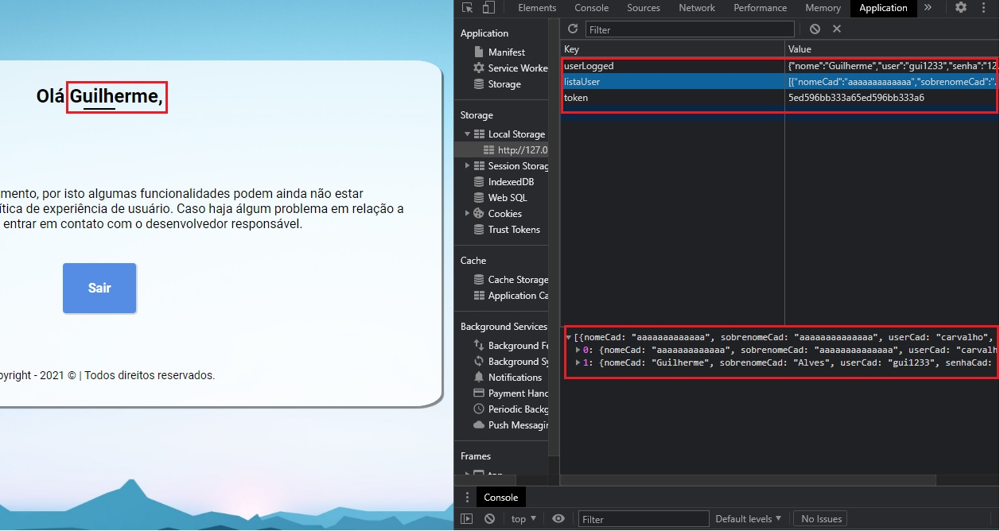
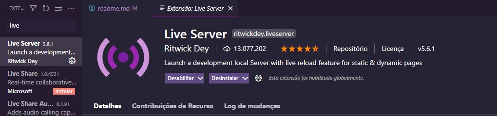

<h1>Olá ❕</h1>

<h2>Este é um projeto realizado com base em meus estudos em HTML5, CSS e JavaScript. </h2>

O projeto consiste em uma página de log-in, linkada a uma página contendo um formulário de cadastro.

</img>
 
</img>

<h2>Como funciona ❔</h2>

   → Foi usado <strong>HTML5, CSS Flexbox, JavaScript Básico</strong> em alguns elementos de manipulação do DOM, assim como a conexão foi feita usando o <strong>localStorage</strong> do navegador como "banco de dados" e por meio de um arquivo <strong>JSON</strong> padrão do navegador realizada a alimentação das informações do usuário cadastrado também como a manipulação dos mesmos para a exibição na aplicação.

</img>
 
</img>

→ A validação do login é feito por um <strong>token</strong> de 16 carácteres aleatórios gerados toda vez que o usuário efetua log-in, barrando o acesso a tela de início aos usuários que não possuirem cadastro no sistema.

</img>

<h3>
Tudo feito com conhecimento básico em JavaScript e Document object Model ✔️
</h3>

<em>'Este projeto não possui fins lucrativos, foi realizado com base em meus estudos.'</em>

<h2>❗ ATENÇÃO ❗ ⚠️</h2>

<strong> → O projeto foi criado ultilizando a extensão Live-Sever do VSCode. Caso não ultilize, a experiência será comprometida!</strong>
<strong> → Para melhor experiência inicie a pasta com a extensão Live-Server!.</strong>

</img>

 --João Vítor Carvalho --

